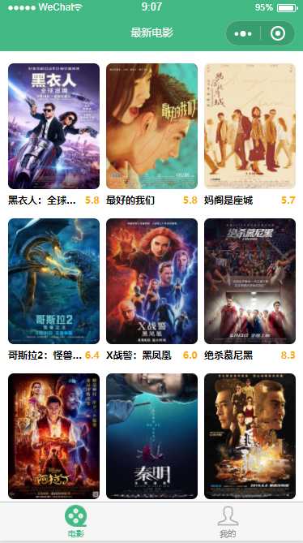
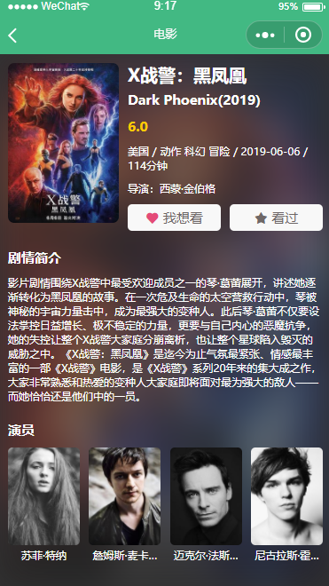
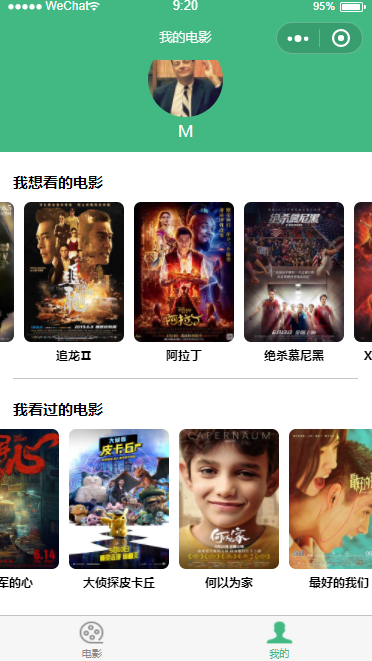

### 预览：   
1、电影列表：  
   
通过云函数调用豆瓣API获取到最新电影列表，点击图片进入电影详情页面。   
    
2、电影详情：  
进入页面时会先获取云数据库中的数据，检测电影是否想看或看过。   
  
   
点击我想看收藏电影，点击我看过进入评价页面   
   
3、评价页面：  
进入页面时会先获取云数据库中的数据，检测电影是否想看或看过，如果看过则获取评价的信息，显示删除及更新评价按钮，如果已想看，则会在评价之后从数据库likes中删除，并添加到数据库comment
  
已经评价过的电影，点击已看过再次进入评价页面，可以删除及修改评价。  
  
    
4、我的：  
  
获取云数据库中的电影id，调用云函数获取电影信息渲染至页面      
    
### 说明：   
1、云函数：  
一共四个云函数：   
login: 获取用户openid  
movielist: 获取最新电影列表  
getDetail: 获取电影详情   
myList: 获取我收藏的电影的详情列表   
   
2、云数据库：  
likes和comment分别存储我想看的电影和我看过的电影   
   
3、云存储   
存储评价中的图片，生成的fileIds保存到数据库comment中
